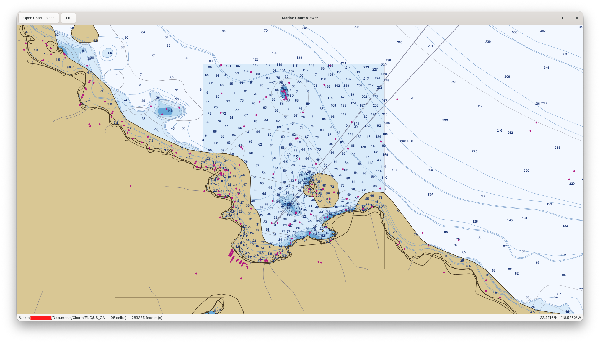

# Marine Chart Viewer

A small, streamlined ENC (S-57) chart viewer built with **GTK 4** and **GDAL**.
No wxWidgets. The whole thing is ~600 lines of C++ and does exactly one thing:
pick a folder of ENC cells, then pan and zoom around a single stitched chart.

This is intended as the seed of a larger, more modern chartplotter — the design
keeps chart parsing, the viewport/renderer, and the application shell in separate
units so each can grow independently.



## What it does

- A toolbar button opens a folder picker; the chosen directory is remembered
  between launches (stored in a small INI file under the user config dir).
- Every ENC base cell (`*.000`) found **recursively** under that folder is read
  via GDAL's S-57 driver.
- All cells are projected into one spherical-Mercator coordinate space, so
  adjacent cells line up automatically — they appear as one continuous chart.
- Drag to pan, scroll wheel to zoom (zoom focuses on the cursor). The **Fit**
  button re-frames the whole dataset. The status bar shows the live cursor
  latitude/longitude.

It deliberately does nothing else: no routing, no AIS, no GPS, no S-52 symbology.

## Rendering notes

Geometry is drawn with Cairo using a simple painter's-algorithm layering:

1. Depth areas (`DEPARE`/`DRGARE`), shaded shallow→deep (darker blue = shoaler).
2. Land areas (`LNDARE`), tan fill with an outline.
3. Other polygons as faint outlines only (so they don't obscure the chart).
4. Depth contours (`DEPCNT`), coastline (`COALNE`/`SLCONS`), other lines.
5. Soundings (`SOUNDG`) as depth labels and other point objects as dots —
   only once you've zoomed in, to avoid clutter.

This is a readable approximation, **not** official S-52 symbology, and must not
be used for navigation.

## Building

Requires GTK ≥ 4.10 (for `GtkFileDialog`/`GtkAlertDialog`), GDAL with the S-57
driver (standard in all common builds), CMake ≥ 3.16, and a C++17 compiler.

### Windows (MSYS2 — recommended)

Install [MSYS2](https://www.msys2.org/), open the **MINGW64** shell, then:

```bash
pacman -S --needed \
    mingw-w64-x86_64-toolchain \
    mingw-w64-x86_64-cmake \
    mingw-w64-x86_64-pkgconf \
    mingw-w64-x86_64-gtk4 \
    mingw-w64-x86_64-gdal

cmake -S . -B build -G Ninja
cmake --build build
./build/chartviewer.exe
```

To distribute the `.exe` outside the MSYS2 shell you'll need to ship the
dependent DLLs and GDAL's data files (`GDAL_DATA`); `ldd build/chartviewer.exe`
from the MINGW64 shell lists what to copy.

### Linux

```bash
# Debian/Ubuntu
sudo apt install cmake g++ pkg-config libgtk-4-dev libgdal-dev
# Fedora
# sudo dnf install cmake gcc-c++ pkgconf gtk4-devel gdal-devel

cmake -S . -B build
cmake --build build
./build/chartviewer
```

### macOS (Homebrew)

```bash
brew install cmake pkg-config gtk4 gdal
cmake -S . -B build
cmake --build build
./build/chartviewer
```

> **GDAL pkg-config fallback.** If `pkg_check_modules(... gdal)` fails because
> your GDAL install ships only `gdal-config` (older builds), replace the GDAL
> block in `CMakeLists.txt` with `find_package(GDAL REQUIRED)` and link
> `GDAL::GDAL`.

## Test data

Free ENC cells are available from NOAA for US waters — search for
"NOAA ENC direct download". Unzip an exchange set anywhere and point the app at
the top folder; it will find the `.000` cells underneath (typically inside
`ENC_ROOT/<cell>/`).

## Layout

```
src/projection.hpp     Mercator <-> lon/lat helpers
src/chart_loader.*     ChartSet: GDAL S-57 reading, projection, feature model
src/chart_widget.*     GtkDrawingArea wrapper: viewport, rendering, pan/zoom
src/settings.hpp       Remembering the chart folder (GKeyFile)
src/main.cpp           GtkApplication, window, header bar, folder picker
```

## Known limitations / natural next steps

- **Loading is synchronous** and briefly blocks the UI on large datasets. Move
  `ChartSet::loadDirectory` to a worker thread (`GTask`) and post the result
  back with `g_idle_add`.
- No tiling/level-of-detail: all features are kept in memory and culled per
  frame by bounding box. Fine for a handful of cells; a spatial index
  (e.g. an R-tree) and feature simplification would be needed to scale up.
- Symbology is approximate. Real S-52 rendering (with the symbol library and
  depth/safety-contour logic) is the big piece a true chartplotter adds next.
- ENC update files (`.001`, `.002`, …) are not applied; only base cells are read.
